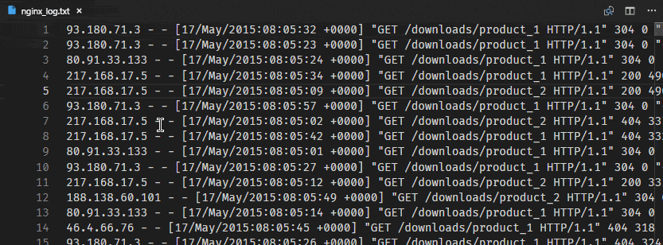
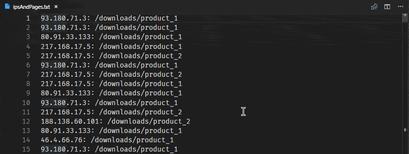

# Text Power Tools

Text Power Tools is an extension for text manipulation inspired by _TextFX_ for Notepad++ and _Filter Lines_ for Sublime Text. All commands supports multiple selections where it is applicable, and many of them can target new documents, so the original source remains unchanged.

## Features

### Filtering lines (grep)

Filter line commands take an input (a raw text or a regular expression) and filter the selected lines based on whether to include or exclude the them. They work like `grep` but inside VS Code. These commands search/match in a case insensitive manner. To use case sensitive search/match, set the value of the `textPowerTools.caseSensitiveFiltering` setting to `true`.

The last 10 filter strings and regular expressions are presented and can be used quickly when executing these commands.

| Command | Input | Description | Selection support |
| ------- | ----- | ----------- | ------------------|
| **Filter lines including string** | Raw text | Replaces the content of all selections (or the full document if nothing is selected) with only the lines which include the input string. | Supports multiple selections. Works on the full document if nothing selected.
| **Filter lines including string into a new editor** | Raw text | Creates a new document with the lines which include the input string. | Supports multiple selections. Works on the full document if nothing selected.
| **Filter lines matching a regex (grep)** | Regular expression | Replaces the content of all selections (or the full document if nothing is selected) with only the lines which match the regular expression. | Supports multiple selections. Works on the full document if nothing selected.
| **Filter lines matching a regex (grep) into a new editor** | Regular expression | Creates a new document with the lines which match the regular expression. | Supports multiple selections. Works on the full document if nothing selected.
| **Filter lines not including string** | Raw text | Replaces the content of all selections (or the full document if nothing is selected) with only the lines which do not include the input string. | Supports multiple selections. Works on the full document if nothing selected.
| **Filter lines not including string into a new editor** | Raw text | Creates a new document with the lines which do not include the input string. | Supports multiple selections. Works on the full document if nothing selected.
| **Filter lines not matching a regex (grep)** | Regular expression | Replaces the content of all selections (or the full document if nothing is selected) with only the lines which do not match the regular expression. | Supports multiple selections. Works on the full document if nothing selected.
| **Filter lines not matching a regex (grep) into a new editor** | Regular expression| Creates a new document with the lines which do not match the regular expression. | Supports multiple selections. Works on the full document if nothing selected.

### Extracting information from text

Extract information from the source lines using regular expressions. First input is the regular expression which should be matched with capture groups to find the desired parts of the lines. The second input is the replacement rule, which should contain capture group references. With these commands you can transform matching lines to the desired format in seconds.

The last 10 filter strings and replacement expressions are presented and can be used quickly when executing these commands.

| Command | Input | Description | Selection support |
| ------- | ----- | ----------- | ------------------|
| **Extract information from text** | Regular expression and a replacement rule | Extracts captured information and transforms matching lines to the desired format. | Supports multiple selections. Works on the full document if nothing selected.
| **Extract information from text into a new editor** | Regular expression and a replacement rule | Creates a new document with extracted and transformed information from the original document. | Supports multiple selections. Works on the full document if nothing selected.

### Counting line occurrences

| Command | Input | Description | Selection support |
| ------- | ----- | ----------- | ------------------|
| **Count line occurrences** | _none_ | Counts line occurrences and transforms the selections/document to show the resuls. The result contains two columns, the line count and the actual line separated with a tabulator.
| **Count line occurrences into a new editor** | _none_ | Counts line occurrences and creates a new document to show the resuls. The result contains two columns, the line count and the actual line separated with a tabulator.

### Removing lines

| Command | Input | Description | Selection support |
| ------- | ----- | ----------- | ------------------|
| **Remove duplicated lines** | _none_ | Removes all duplicates of lines, so only the first occurrence remains in the document or selections. | Supports multiple selections. Works on the full document if nothing selected.
| **Remove blank lines** | _none_ | Removes all blank lines from the document or selections. | Supports multiple selections. Works on the full document if nothing selected.
| **Remove surplus blank lines** | _none_ | Removes surplus blank lines if there are two or more are in the document or selections consecutively. | Supports multiple selections. Works on the full document if nothing selected.

### Insert numbers
Inserts incremental decimal or hex numbers to every selection. When inserting hex numbers, by default they will be uppercase. To insert lowercase hex numbers, set the value of the `textPowerTools.insertUppercaseHexNumbers` setting to `false`.

| Command | Input | Description | Selection support |
| ------- | ----- | ----------- | ------------------|
| **Insert decimal numbers** | _none_ | Inserts incremental decimal numbers starting with 1 to every selection. | Supports multiple selections.
| **Insert decimal numbers starting at...** | _none_ | Inserts incremental decimal numbers starting with the number provided by the user to every selection. | Supports multiple selections.
| **Insert decimal numbers with custom increments** | _none_ | Inserts incremental decimal numbers using custom increments starting with 1 to every selection. | Supports multiple selections.
| **Insert decimal numbers with custom increments starting at...** | _none_ | Inserts incremental decimal numbers using custom increments starting with the number provided by the user to every selection. | Supports multiple selections.
| **Insert hex numbers** | _none_ | Inserts incremental hex numbers starting with 1 to every selection. | Supports multiple selections.
| **Insert hex numbers starting at...** | _none_ | Inserts incremental hex numbers starting with the number provided by the user to every selection. | Supports multiple selections.
| **Insert hex numbers with custom increments** | _none_ | Inserts incremental hex numbers using custom increments starting with 1 to every selection. | Supports multiple selections.
| **Insert hex numbers with custom increments starting at...** | _none_ | Inserts incremental hex numbers using custom increments starting with the number provided by the user to every selection. | Supports multiple selections.

## Requirements

This extension requires at least Visual Studio Code 1.26.

## License

MIT

Sample images use text files from the [Elasticsearch Examples](https://github.com/elastic/examples) and [TensorFlow Models](https://github.com/tensorflow/models) projects. Both are under the Apache 2.0 License.